# handoff

A skill that has a coding agent write a resumable checkpoint
of a repository when you ask for one: a `HANDOFF.md`
snapshot of the current state, a `HANDOFF.log.md` that
entries are appended to (earlier ones change only for typo
fixes or corrections the user asks for), and, when several agents share the work, a
`handoff/state.json` registry of who owns what. It ships one
small program, a collector that reports the repository's git
state and that registry.

The collector prints one table row per agent in state.json.

<picture>
  <source
    media="(prefers-reduced-motion: reduce)"
    srcset="assets/poster.svg"
  />
  
</picture>

The demo is reconstructed from
[`evidence/transcripts/collector-session.txt`](evidence/transcripts/collector-session.txt),
a captured run of the collector on the synthetic repository
in [`examples/synthetic-repo/`](examples/synthetic-repo/).
Of the collector's Markdown report it shows the summary
bullets and the ownership table; the transcript has the
whole report.

**Not measured, stated up front.**

- No agent produced the demo or the collector transcript.
  They show only the collector, run from a shell on a
  synthetic repository.
- Whether a snapshot that an agent writes by following
  `SKILL.md` lets a different agent resume the work has not
  been measured.
- Whether an agent appends a log entry only on a state
  transition, and not at the end of every turn, has not been
  measured.
- The agent invocations under Evidence loaded the skill
  from a plugin directory (Claude Code) and from a
  repository's `.agents/skills/` (Codex), not through the
  install blocks below.

## What is in it

- [`skills/handoff/SKILL.md`](skills/handoff/SKILL.md) is
  the spec: when to use it, the paths and their defaults,
  the workflow, and the safety rules.
- [`skills/handoff/references/update-protocol.md`](skills/handoff/references/update-protocol.md)
  is the update sequence, the state transitions that earn a
  log entry, and the registry fields the collector reads.
- [`skills/handoff/references/snapshot-template.md`](skills/handoff/references/snapshot-template.md)
  and
  [`skills/handoff/references/log-entry-template.md`](skills/handoff/references/log-entry-template.md)
  are the shapes of `HANDOFF.md` and of one log entry.
- [`skills/handoff/scripts/collect_handoff_state.py`](skills/handoff/scripts/collect_handoff_state.py)
  is the collector.
- [`examples/`](examples/) is a worked example: a synthetic
  repository at a handoff checkpoint of two agent lanes,
  with all three files filled in by hand for this release,
  not by an agent running the skill.

## Paths

Every path is relative to the root of the repository you
choose: the one the handoff describes. When that
repository's own instructions name other files, the skill
tells the agent to use those. Otherwise the defaults are
`HANDOFF.md`, `HANDOFF.log.md`, `handoff/state.json` and
`handoff/agents/` for optional per-agent notes.

The collector takes the root as `--repo` (default `.`) and
uses the top level of the git repository that contains it.
It reads the registry from `--state-file` (default
`handoff/state.json`) and refuses an absolute path, one that
resolves outside that root, and one it cannot resolve. Run
it with Python 3.9 or later; it needs `git` on `PATH` and
nothing outside the standard library. It was tested with git
2.50.1. `make record` and the tests need git 2.32 or later
(`git init -b` and `GIT_CONFIG_GLOBAL`).

```sh
python3 skills/handoff/scripts/collect_handoff_state.py --repo .
python3 skills/handoff/scripts/collect_handoff_state.py --repo . --json
```

It exits 0 after printing the report, 1 when `--repo` is
not inside a git working tree, and 2 on a usage error,
including a refused `--state-file`. `--repo` is checked
first. Status 1 also covers any directory git will not
treat as a working tree, such as a bare repository or one
git refuses as unsafe. A missing registry, or one that
Python's `json` module cannot parse or that is not the
expected shape, is reported in the output with exit status
0. That module also accepts `NaN` and `Infinity`, which are
not valid JSON; the collector passes them through, and
`--json` prints them as they are. Without `git` on `PATH` it stops
with a Python traceback and status 1.

## Not included

The skill calls no other skill. Its workflow tells the
agent to run the repository's own formatting and validation
commands, and to follow that repository's instructions for
any provenance or memory records it keeps; neither ships
here.

`swe-day`, published at
[trycopilotai/swe-day](https://github.com/trycopilotai/swe-day),
names a skill called `handoff` as its handoff recorder at
step 16. Installed under that name, this skill fills that
role. It does not need swe-day.

## Use it

Read [`skills/handoff/SKILL.md`](skills/handoff/SKILL.md)
before you install it. The file is an instruction set that
steers an agent, so both installs below are pinned to a tag
rather than to `main`.

### Claude Code

Both blocks need a POSIX shell and a `git` that checks out
symbolic links, so they do not run as written in Windows
`cmd` or PowerShell.

Save this as `install.sh` and run it with `sh install.sh`.
It sets `set -eu` and an `EXIT` trap, so pasting it straight
into an interactive shell will end that shell if the clone
fails.

```sh
set -eu
release=v0.1.2
install_target="$HOME/.claude/skills/handoff"
install_parent="$(dirname "$install_target")"
mkdir -p "$install_parent"
install_tmp="$(mktemp -d "$install_parent/.handoff.XXXXXX")"
install_stage="$install_tmp/package"
rollback_install() {
  if [ ! -e "$install_target" ]; then
    if [ -e "$install_tmp/previous" ]; then
      mv "$install_tmp/previous" "$install_target"
    fi
  fi
  rm -rf "$install_tmp"
}
trap rollback_install EXIT
git clone --quiet --depth 1 --branch "$release" \
  https://github.com/trycopilotai/handoff \
  "$install_tmp/clone"
mkdir -p "$install_stage"
cp -R "$install_tmp/clone/skill/." "$install_stage/"
if [ -e "$install_target" ]; then
  mv "$install_target" "$install_tmp/previous"
fi
mv "$install_stage" "$install_target"
trap - EXIT
rm -rf "$install_tmp"
```

Invoke it as `/handoff`.

### Codex

Save this one the same way. The only line that differs from
the block above is `install_target`.

```sh
set -eu
release=v0.1.2
install_target="$HOME/.agents/skills/handoff"
install_parent="$(dirname "$install_target")"
mkdir -p "$install_parent"
install_tmp="$(mktemp -d "$install_parent/.handoff.XXXXXX")"
install_stage="$install_tmp/package"
rollback_install() {
  if [ ! -e "$install_target" ]; then
    if [ -e "$install_tmp/previous" ]; then
      mv "$install_tmp/previous" "$install_target"
    fi
  fi
  rm -rf "$install_tmp"
}
trap rollback_install EXIT
git clone --quiet --depth 1 --branch "$release" \
  https://github.com/trycopilotai/handoff \
  "$install_tmp/clone"
mkdir -p "$install_stage"
cp -R "$install_tmp/clone/skill/." "$install_stage/"
if [ -e "$install_target" ]; then
  mv "$install_target" "$install_tmp/previous"
fi
mv "$install_stage" "$install_target"
trap - EXIT
rm -rf "$install_tmp"
```

Invoke it as `$handoff`.

Each block works in a temporary `.handoff.*` directory
beside the target and removes it on exit. An existing
install directory at the target is replaced.

Each block was run twice against this repository's v0.1.0
tag, cloned from a local `file://` URL with git 2.50.1, not from
GitHub. Each time the clone printed a warning that
`refs/tags/v0.1.0` "is not a commit" and a detached `HEAD`
note, still checked out the tagged commit, and the install
completed.

Both blocks copy through `skill/`, a symlink to
`skills/handoff/`, so the installed directory holds
`SKILL.md`, `agents/`, `references/` and `scripts/` as real
files. The worked example under `examples/` is not
installed. The repository also carries
`.claude-plugin/plugin.json` and `.codex-plugin/plugin.json`
for a marketplace. No marketplace lists this skill, so no
marketplace install is described here. The manifests have
not been submitted to or validated by any plugin directory:
they carry no logo or icon, and an uploaded archive would
need the `skill` symlink left out.

## Evidence

`evidence/transcripts/collector-session.txt` is the captured
run behind the claim at the top of this file.
`scripts/record_session.py` built the synthetic repository
from `examples/synthetic-repo/`, then wrote each `$` line
and each exit status; the rest is the collector's output,
with one edit: the throwaway directory's path was replaced
with `/work`. The transcript itself carries no notice of
that. `evidence/demo-manifest.json` is where the edit is
declared, as `replace-capture-root`, beside the SHA-256 of
the collector, of `SKILL.md` and of the example, the
commands, the environment they ran in, the interpreter, the
date, and the SHA-256 of the transcript.

The run can be checked rather than reconstructed. The
synthetic commits have a fixed author and date, so their
ids (`ab7e2fe` and `0a6532a`) do not depend on the machine.
With git 2.50.1, `make record` in a fresh clone wrote the
same transcript except the `Generated UTC` line; another git
version may word git's own lines differently. In the
manifest the transcript's SHA-256 changes, `date` changes on
a different UTC day, and `interpreter` changes under a
different Python version. `make check` rebuilds the
synthetic repository and compares its two `git log` lines
with the transcript.

`make check` runs the collector's own tests and a packaging
contract that ties this file, both plugin manifests, the
example, the transcript and the demo images to each other.

### Agent invocations

Each client was started on one synthetic fixture with the
v0.1.0 skill text: a small Python repository in one commit,
with a `handoff/state.json` registry of one agent lane and an
uncommitted `--shout` flag in `greeter.py`, and a task note in
the prompt. `skills/handoff/` is unchanged since v0.1.0. This
is one run per client, not a benchmark.

- [`evidence/transcripts/2026-10-08-claude-code-invocation.txt`](evidence/transcripts/2026-10-08-claude-code-invocation.txt):
  Claude Code 2.1.220, invoked with `/handoff`. It loaded the
  skill, ran the collector and `make check`, and wrote
  `HANDOFF.md` and `HANDOFF.log.md` with one entry. It left
  `handoff/state.json` unchanged and committed nothing.
- [`evidence/transcripts/2026-10-08-codex-invocation.txt`](evidence/transcripts/2026-10-08-codex-invocation.txt):
  Codex 0.146.0, invoked with `$handoff`. It read `SKILL.md`
  and its references, ran the collector with `--json` and
  `make check`, and wrote the same two files. It left the
  registry unchanged and committed nothing.

Neither run shows whether another agent can resume from the
snapshot. A first Claude Code run, beside other checkouts,
listed the top level of `/` although the prompt said to stay
inside the fixture, so it was re-run in a fresh temporary
directory; the manifest records it with `"published": false`.

`scripts/render_invocation.py` wrote both transcripts from
the clients' raw output, which is not committed. It keeps
each tool call's name, arguments and status, not the tool's
output, and cuts any argument string longer than 300
characters, marking the cut `...[N more characters]`. Its
only other edits are the ones `evidence/demo-manifest.json`
declares for each invocation: `replace-isolation-root`,
`replace-plugin-root`, `replace-capture-root`,
`replace-scratch-root`, `replace-home` and
`replace-hostname`. The manifest also records each model,
prompt and outcome and both files' SHA-256.

**Known limits.** The report holds absolute paths, branch
names, commit subjects and the registry fields it reads,
unfiltered. Git output that holds three backticks breaks its
Markdown fences, and an unusual submodule path can be
misread. Point the collector only at repositories you trust.
`SECURITY.md` lists these and the other limits.

## Contributing

See [`CONTRIBUTING.md`](CONTRIBUTING.md).

## Security

See [`SECURITY.md`](SECURITY.md).

## License

MIT. See [`LICENSE`](LICENSE).

## Not affiliated with GitHub or GitHub Copilot

The `trycopilotai` organisation name is not a claim of any
relationship with GitHub Copilot. This project is not
affiliated with, endorsed by, or sponsored by GitHub, Inc.
GitHub and GitHub Copilot are trademarks of GitHub, Inc.
